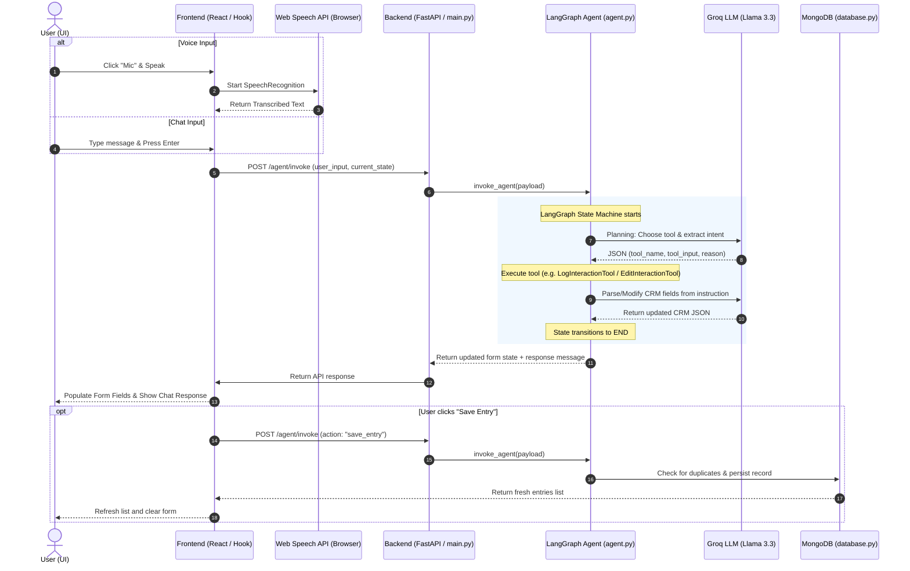

# QuickXForm System Architecture Overview

QuickXForm is a full-stack, AI-powered CRM interaction logging system. It enables healthcare representatives to log, modify, validate, and query interactions with Healthcare Professionals (HCPs) using natural language text, voice commands, and manual form entries.

---

## 1. Core Technology Stack

The application is structured into three main layers:

```
┌────────────────────────────────────────────────────────┐
│                      FRONTEND                          │
│  React (Vite) + Tailwind CSS + Web Speech API (Mic)   │
└──────────────────────────┬─────────────────────────────┘
                           │ HTTP REST APIs
                           ▼
┌────────────────────────────────────────────────────────┐
│                      BACKEND                           │
│  FastAPI (Web Server) + LangGraph (Agentic Workflow)   │
└──────────────────────────┬─────────────────────────────┘
                           │ PyMongo / LLM API
                           ▼
┌────────────────────────────────────────────────────────┐
│                 DATABASE & AI SERVICES                  │
│       MongoDB Atlas  +  Groq API (Llama 3.3 70B)       │
└────────────────────────────────────────────────────────┘
```

- **Frontend:** Built with **React** and **Vite**, styled with **Tailwind CSS**. It manages state for the interactive form, the assistant chat panel, and performs speech-to-text directly in the browser via the Web Speech API.
- **Backend:** A **FastAPI** web server that handles requests, exposes endpoints for the agent and logs, and coordinates database operations.
- **Agentic Layer:** Built using **LangGraph** to coordinate multi-step workflows, tool calls, and state transitions.
- **AI / LLM Layer:** Powered by **Groq Cloud API** using the `llama-3.3-70b-versatile` model for intent recognition, structured entity extraction, and form modifications.
- **Database:** **MongoDB** (local or cloud-hosted Atlas cluster) for persistent storage of HCP interaction records.

---

## 2. Dynamic Interaction Flow (Chat & Voice)

Here is a step-by-step trace of what happens when a user types a message or uses voice commands:



---

## 3. Step-by-Step Flow Details

### Phase A: Input Generation & Processing (Frontend)
1. **User Input Selection:**
   - **Text:** The user types directly into the textarea inside `AssistantChat.jsx` and clicks **Log**.
   - **Voice:** The user clicks the **Mic** button. 
2. **Speech-to-Text Conversion:**
   - If the Mic is clicked, `AssistantChat.jsx` initializes the browser's native `window.SpeechRecognition` (or `webkitSpeechRecognition`).
   - The microphone records audio, streams it to the browser's built-in speech engine, and receives a text transcription in real time via `recognition.onresult`.
3. **API Dispatch:**
   - The transcribed text (or typed text) is passed to `handleSendMessage` in `useInteractionLogger.js`.
   - The hook dispatches a POST request to `${VITE_API_BASE_URL}/agent/invoke` with the payload:
     ```json
     {
       "action": "process_message",
       "user_input": "Met with Dr. Sharma yesterday at 3 PM to discuss vaccine efficacy",
       "current_state": { /* current form field values */ }
     }
     ```

### Phase B: Agentic Decision & Processing (Backend)
4. **FastAPI Route Entry:**
   - `main.py` catches the POST request at `/agent/invoke` and forwards it to `invoke_agent` in `agent.py`.
5. **LangGraph Cycle (`StateGraph`):**
   - The graph manages the `AgentState` containing the message history, user input, form data, and tracking variables.
   - **`llm_node` (Planning & Routing):**
     - The agent calls Groq LLM with a system prompt describing the available tools:
       - `LogInteractionTool`: For new interactions (extraction).
       - `EditInteractionTool` / `ModificationTool`: For modifying fields in the current form.
       - `VoiceAssistantTool`: Special flow for voice notes.
       - `InteractionValidationTool`: For validating entries.
       - `FollowUpSuggestionTool`: Generates AI recommendations.
     - The LLM responds with a tool name and inputs (e.g. `LogInteractionTool` with extraction payload).
     - If the LLM call fails, the graph falls back to rule-based heuristics in `agent.py` to route to the correct tool.
   - **`tool_node` (Execution):**
     - The corresponding tool class from `crm_tools.py` is invoked:
       - **Extraction (`llm_extract`):** The LLM parses natural language text into a structured JSON schema matching CRM fields (HCP name, date, time, attendees, topics, materials shared, sentiment, etc.). It uses temporal relative processing (e.g., converting "yesterday" into the actual date relative to current time).
       - **Editing (`llm_edit`):** The LLM compares the current form state with the user's instructions (e.g., "add Sarah as attendee", "change time to 5pm") and applies partial updates without erasing other field values.
   - **Loop & Finalize:**
     - The graph cycles back to `llm_node`. Since the tool execution is completed, it creates a final user-facing response payload and ends the execution.
6. **Execution Logging:**
   - Before returning, the execution state (input, tool name, tool input, tool output, and final response) is logged in JSONL format to `execution_logs.jsonl`.

### Phase C: Form Syncing & Database Persistence
7. **UI Synchronization:**
   - The backend response is returned to the frontend hook.
   - The hook (`useInteractionLogger.js`) extracts the `form_data` from the response, updates the React state (`formData`), and appends the assistant's explanation (e.g., *"I updated the doctor name to Dr. Sharma and date to 2026-07-08..."*) to `messages`.
   - The fields update on screen in real time in `InteractionForm.jsx`.
8. **Saving & Duplicate Detection:**
   - When the user clicks **Save Entry**, the app checks for potential duplicates using the client-side `detectDuplicateEntry` utility and the backend `DuplicateCheckTool`.
   - The detection checks parameters such as similarity of the HCP name (using SequenceMatcher), overlapping dates, time proximity, and similarity of topics discussed.
   - If a duplicate is detected:
     - A modal (`DuplicateModal.jsx`) appears asking the user to either **Merge** the fields or **Save as New**.
     - **Merge:** The backend merges field values (preserving arrays and longer strings) using `MergeInteractionTool`.
     - **Save as New:** Saves the entry as a standalone record using `saveNewEntry`.
   - The database layer (`database.py`) inserts or updates the record in MongoDB via `pymongo`.

---

## 4. Architectural Highlights & Guardrails

1. **Relative Date Resolution:** Under `crm_tools.py`, functions like `parse_relative_day()` and `parse_relative_weekday()` convert terms like *"yesterday"*, *"next Friday"*, and *"today"* into standardized `YYYY-MM-DD` strings before filling the form.
2. **Rule-Based Fallback:** If the LLM provider is unavailable or rate-limited, `fallback_parse()` uses regular expressions to extract key parameters (names, interaction types) to guarantee basic functionality works offline or under high load.
3. **Execution Transparency:** The "View Logs" panel reads live from `/agent/logs` which exposes `execution_logs.jsonl`. This gives developers and users absolute visibility into which tools the agent ran, the exact prompt/responses sent to Groq, and what database updates occurred.
4. **Data Normalization:** All inputs, whether written manually, via chat, or via voice, are filtered through `normalize_payload()`. This ensures HCP names are properly capitalized and prefixed with `Dr`, sentiments map strictly to allowed sets (`Positive`, `Neutral`, `Negative`), and list fields are split correctly.
